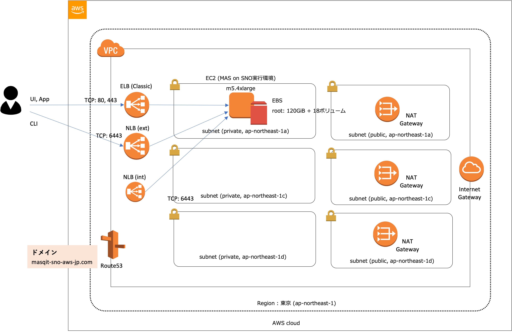

# 構成と前提

### 前提
* 当手順は、作業PCとしてMacまたはWindowsで実施する想定の手順となっております。
  * 作業PCにコンテナ実行環境(DockerあるいはPodman)が導入されていることが前提です。
  * Windowsの場合、Docker Desktopか、WSL2で用意したLinuxにDocker/Podmanを導入する必要があります。
* MASを導入するためのAWSアカウントが利用可能である必要があります。

### 構成
AWS上にm5.4xlargeサイズのEC2インスタンスが用意され、MASが導入されます。

### 前項
- [トップページ](../README.md)

### 次項
- [01 事前準備](../01_prereqs/index.md)
