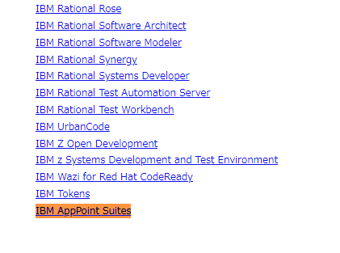
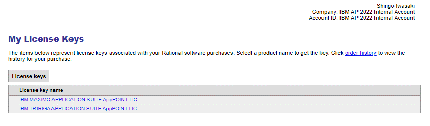
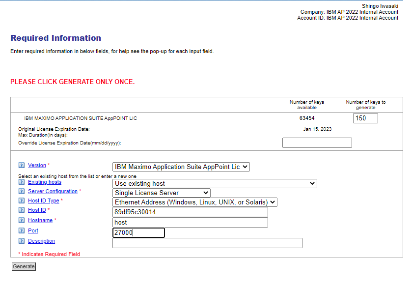
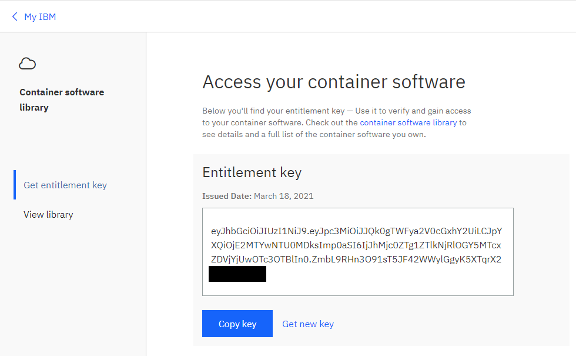
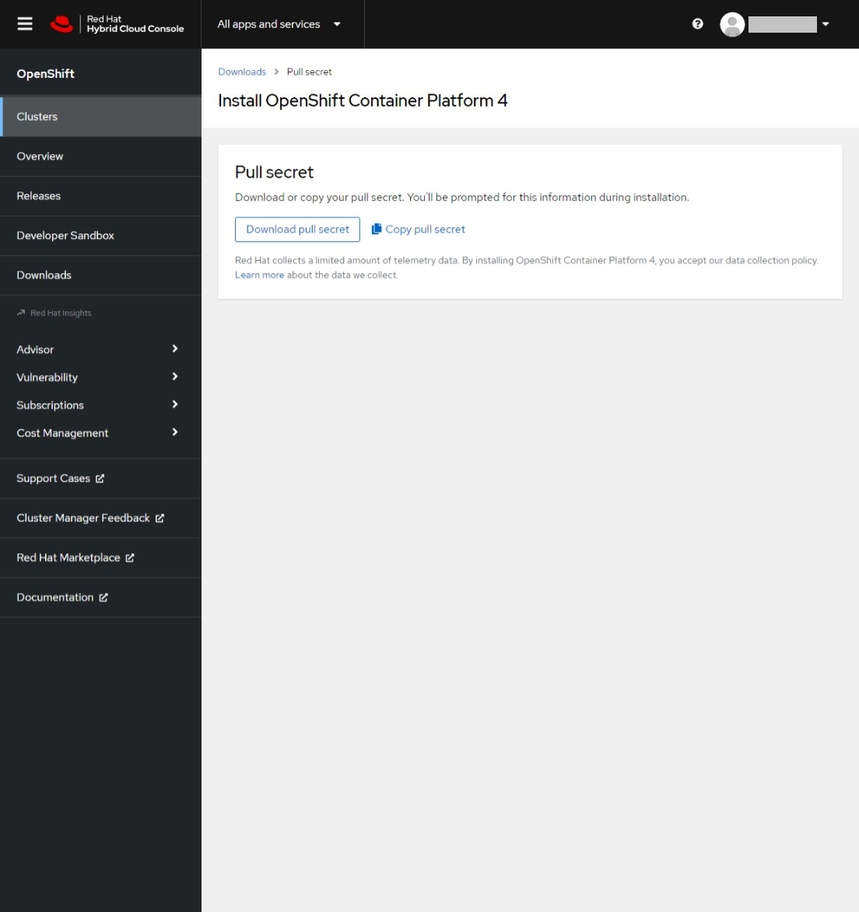

## 1.事前準備

Windows環境の場合はWSLなどのLinux環境の導入が必要となり、シェルコマンドはLinux環境から実行することになります。  
WSLの導入手順については[こちら](https://docs.microsoft.com/ja-jp/windows/wsl/setup/environment)を参照してください。

### 1.AWSアカウントの準備

本手順では、AWS上にMASを導入するため、AWSアカウントを事前にご用意いただく必要があります。
利用するAWSアカウントがない場合、事前に取得ください。

### 2.インストール実行環境の準備

1. インターネット接続可能なdockerまたはpodmanコマンドが使用可能な環境を用意します。  
  当手順では以降podmanを使用して手順を進めます。

    podmanの導入方法は以下リンク先のPodman Installation Instructionsを参照してください。  
    https://podman.io/getting-started/installation

    WindowsやMacでpodmanを使用する方は、事前に下記のコマンドでpodmanをstartしておいてください。  
    ```bash
    podman machine start
    ```
    詳細はpodmanのドキュメントをご参照ください。  
    https://docs.podman.io/en/latest/markdown/podman-machine-start.1.html

### 3.MASライセンスファイルの取得

社内利用では、MASのライセンスファイルはLicense Key Centerから取得します。  
お客さま環境構築やPoC用のライセンスを持っている場合は以下の操作をスキップしてください。

1. ランダムな12桁の16進数形式の文字列を用意します。

    ここで生成した文字列(Host ID)はインストール時にも必要になるため控えておいてください。  

    ```bash
    ■Host IDとは：
    Host IDとは、ライセンス・キーを登録するマシンのハードウェアを識別するために用いられる用語になります。  
    License Key Centerでは、Host IDにはイーサネットアドレスを入力するように案内されています。  
    ただし、OpenShiftクラスター環境の今回のインストール方式(ibm/cli)では、Host IDはMAS installの段階で作成されるため、MAS install前に取得することはできません。  
    その為、事前に乱数などを利用してHost IDを作成する必要があります。
    ```
    参考までに、ランダムな12桁の16進数形式の文字列を生成するコマンドを記載します。


    ```bash
    masenv@IBM-PF39YTN4:~$ openssl rand -hex 6
    89df95c30014
    ```


2. License Key Centerへアクセスしてログインします。

    https://www.ibm.com/support/pages/ibm-support-licensing-start-page

3. Get keysより、IBM AppPoint Suites を開きます。

    

4. IBM MAXIMO APPLICATION SUITE AppPOINT LIC を選択します。

    

5. Nextボタンをクリックします。

6. 必要項目を入力します。


    | 項目                                          | 値                                                  |
    | --------------------------------------------- | --------------------------------------------------- |
    | **IBM MAXIMO APPLICATION SUITE AppPOINT LIC** | 150 (必要に応じて変更)                            |
    | **Override License Expiration Date**          | (空欄)                                            |
    | **Version**                                   | IBM Maximo Application Suite AppPoint Lic           |
    | **Existing hosts**                            | Use existing host                                   |
    | **Server Configuration**                      | Single License Server                               |
    | **Host ID Type**                              | Ethernet Address (Windows, Linux, UNIX, or Solaris) |
    | **Host ID**                                   | (1. で作成したランダムな12桁文字列)               |
    | **Hostname**                                  | host                                                |
    | **Port**                                      | 27000                                               |
    | **Description**                               | (空欄)                                            |


    

7. Generateボタンをクリックします。

8. Download License Kyesボタンをクリックします。

    「license.dat」 という名前のファイルがダウンロードされます。


### 4.IBM Entitlement Keyの取得

IBM Container Library にログインしてEntitlement Keyを取得します。

1. 下記にアクセスしてログインします。

    https://myibm.ibm.com/products-services/containerlibrary

2. Copy keyボタンをクリックします。

    

3. テキストファイルなどに貼り付けて保存します。


### 5.pull-secretの取得

1. pull-secretを取得する。

    pull-secretは以下のURLから取得します。
    <https://console.redhat.com/openshift/install/pull-secret>

    「Download pull secret」をクリックすることでファイルを取得します。
    

### 前項
- [ 00_構成と前提 ](../00_architecture/index.md)

### 次項
- [ 02_AWS準備 ](../02_aws_prepare/index.md)
