## 2.AWS準備
MAS SNOのプロビジョニング先として、AWSを利用する場合の事前準備について説明します。

### 1． IAMユーザーの作成

1. MASをAWSにプロビジョニングする際に使用するIAMユーザーを作成します。

    IAMから任意の名前でIAMユーザーを新規に作成 します。(本手順では「masqit-sno-aws-jp」と指定しています)
    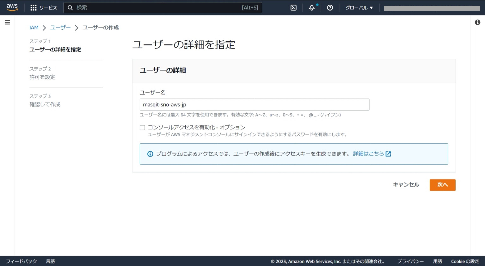

    ポリシーはAdministoratorAccesをアタッチします。
    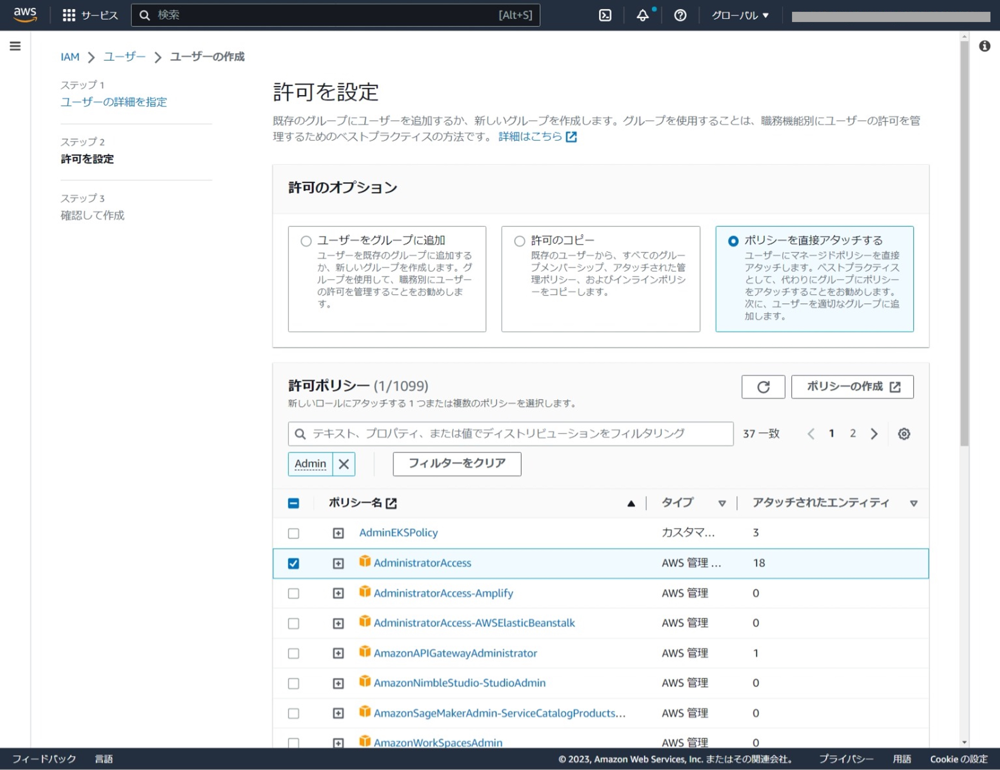

    確認したら「ユーザーの作成」をクリックします。
    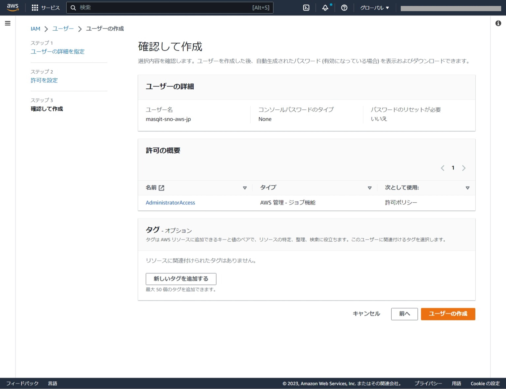

### 2. アクセスキーの作成

1. コマンドラインからIAMユーザーで操作する為、アクセスキーを作成します。

    1.で作成したIAMユーザーの「セキュリティ認証情報」を選択します。そして、「アクセスキー」の項目から「アクセスキーを作成」をクリックします。
    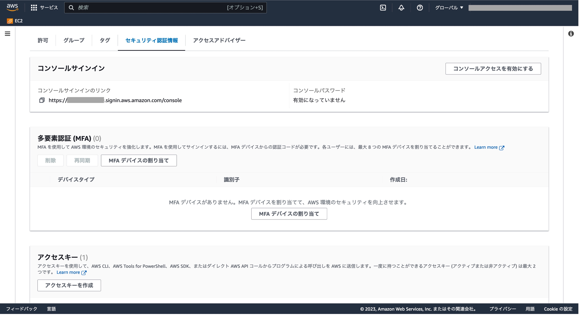
    
    アクセスキーの作成画面で、「コマンドラインインタフェース」を選択し、画面下にスクロールして「次へ」をクリックします。
    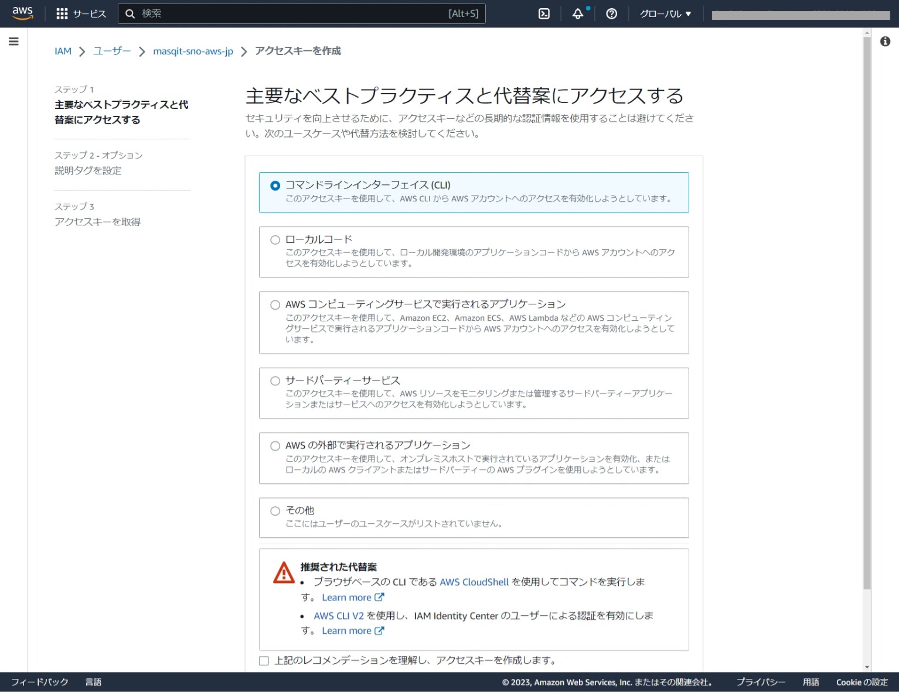

    アクセスキーが作成されるのでCSVファイルをダウンロードします。
    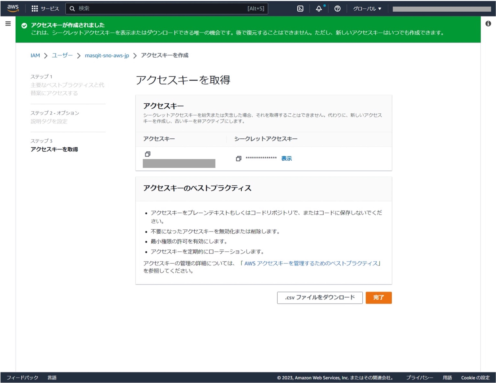

### 3. Route 53の作成

1. MAS導入の前提となるOpenShift Container Platformで必要なドメインを取得します。
      
    Route 53を検索し、「ドメインの登録」をクリックします。
    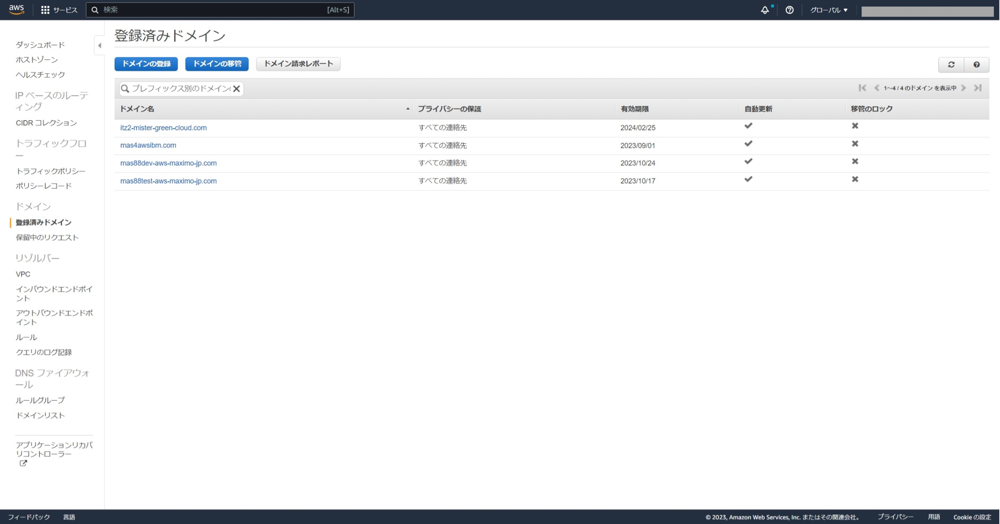
    
    任意のドメイン名を入力して利用可能かを確認します。
    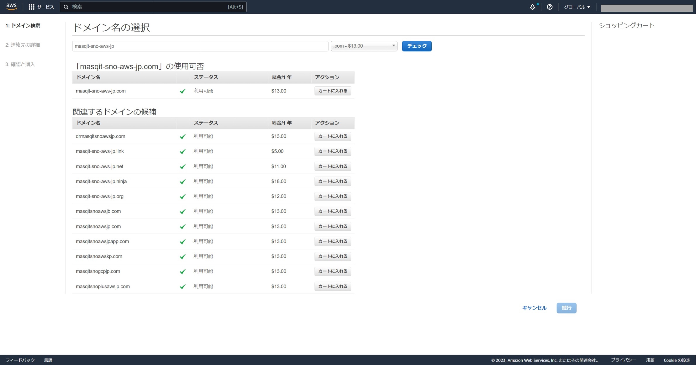

    連絡先を入力します。
    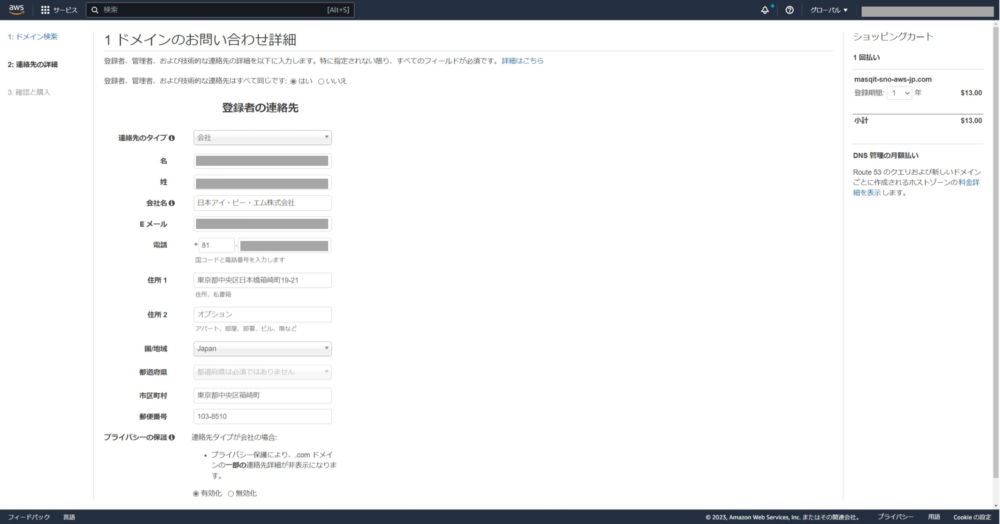

    Route 53をオーダーすると登録したメールアドレス宛にメールが送付されます。
    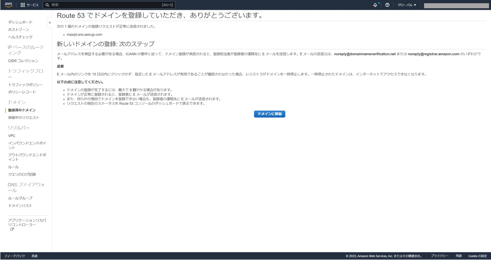
    
    ドメインの承認メールが届くので、メール内にあるURLリンクをクリックします。
    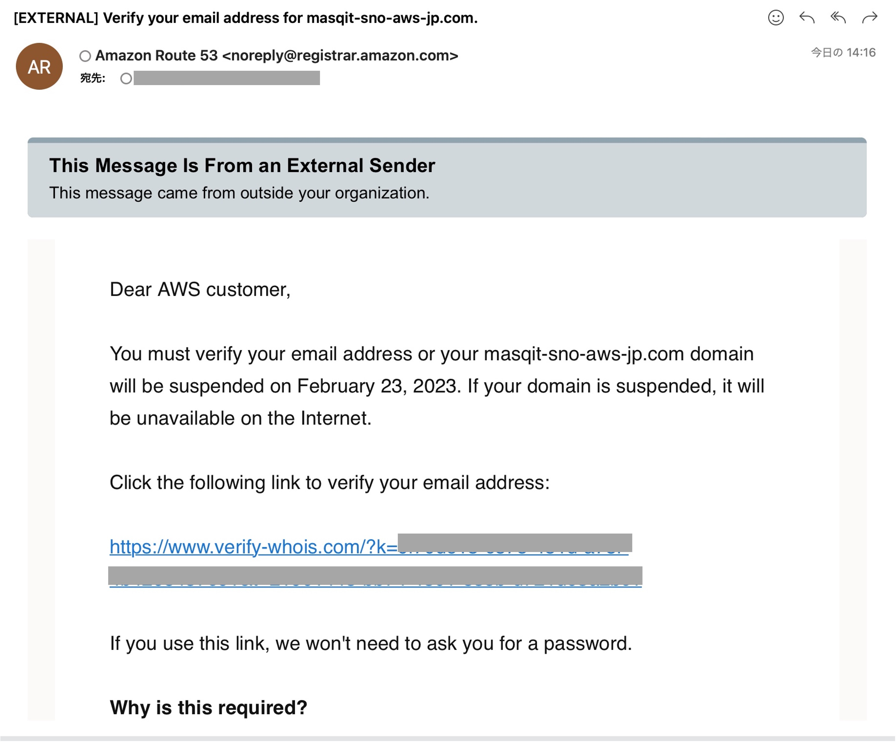

    URLリンクをクリックすると、ドメインの承認が完了します。
    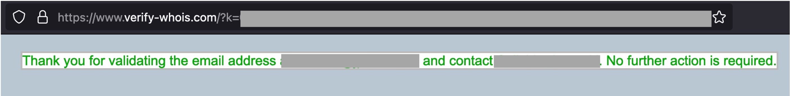

    承認されるとRoute 53でオーダーしたドメインが使用可能となります。
    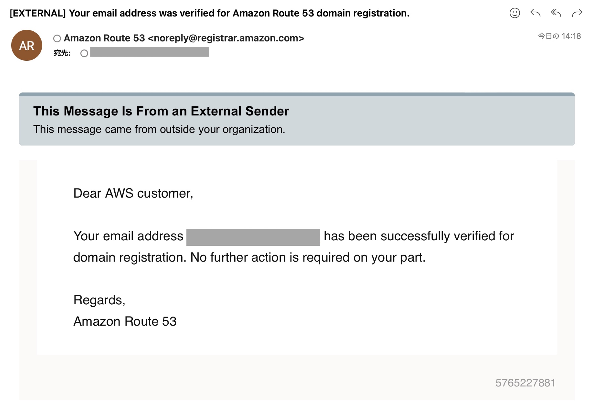
    
    
### 前項
- [ 01_事前準備 ](../01_prereqs/index.md)

### 次項
- [ 03_MAS/MANAGEインストール ](../03_manageinstall/index.md)
