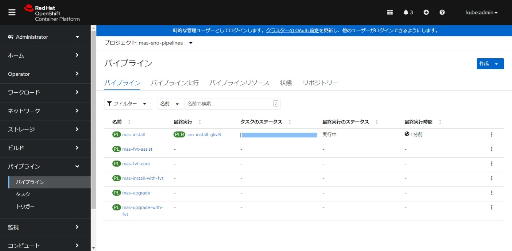
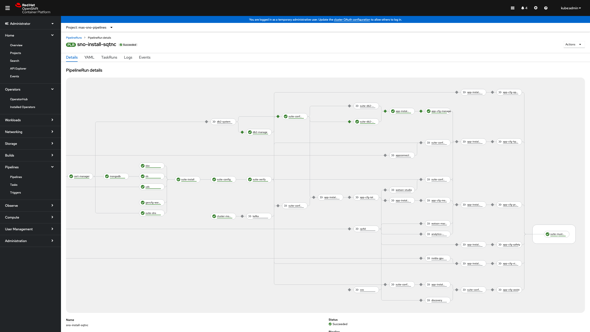

## 3.MAS/MANAGEインストール

ibmmas/cliコンテナイメージ内で、playbookを実行してMASをインストールします。コンテナイメージはRed Hat Quay.ioで公開されているibmmas/cliを利用します。

### 1. cliコンテナイメージの確認


1. コンテナイメージを取得、起動します。

    イメージを取得します。
    ```bash
    ## latestでpullする場合
    $ podman pull quay.io/ibmmas/cli:latest 
    ## バージョン指定してpullする場合
    $ podman pull quay.io/ibmmas/cli:3.14.0
    ```
    本手順での検証期間中、latestタグのコンテナイメージのバージョンは3.14.0でした。  
    実施タイミングにより、latestタグで取得されるバージョンが変わり、設定項目が変わる可能性がある点にご注意ください。

    イメージを確認します。
    ```bash
    $ podman images
    REPOSITORY                             TAG            IMAGE ID       CREATED        SIZE
    quay.io/ibmmas/cli                     latest         35335ce53791   5 weeks ago    1.97GB
    ```
  
    イメージを起動します。
    ```bash
    $ podman run -dit --name sno quay.io/ibmmas/cli:latest bash
    ```

### 2. MASプロビジョニング前準備

1. 必要ファイルを確認します。
   
    | ファイル名  | 説明                 | 設定値                |
    | ----------- | -------------------- | --------------------- |
    | pull-secret | シークレットファイル | 「01_事前準備」で取得 |
    | license.dat | ライセンスファイル   | 「01_事前準備」で取得 |


1. コンテナ内にファイルを配置する準備をします。

    配置するフォルダを準備します。
    ```bash
    $ podman exec -it sno bash
    $ mkdir /opt/app-root/src/masconfig
    $ exit
    ```

    pull-secret及びlicense.datをコンテナ内の指定ディレクトリに配置します。
    ```bash
    $ podman cp pull-secret sno:/opt/app-root/src/masconfig/pull-secret
    $ podman cp license.dat sno:/opt/app-root/src/masconfig/license.dat
    ```


### 3. MASプロビジョニング

MASプロビジョニングコマンドを使用してAWS上にRed Hat OpenShift Container Platform(OCP)を準備します。
playbookにより自動で環境が払い出されます。
OCPのURL、Username、Passwordのログイン情報はプロビジョニング中のログに出力されます。

プロビジョニングする際の変数は以下の通りです。  


| 設定値                | 説明                                | 設定値                |
| --------------------- | ----------------------------------- | --------------------- |
| AWS API Key ID        | AWS_ACCESS_KEY_ID                   | 「02_AWS準備」で取得  |
| AWS Secret Access Key | AWS_SECRET_ACCESS_KEY               | 「02_AWS準備」で取得  |
| AWS Region            | AWSのリージョン                     | ap-northeast-1        |
| AWS Base Domain       | Route 53で作成したドメイン名        | masqit-sno-aws-jp.com |
| Cluster Name          | 任意のクラスタ名                    | sno                   |
| OCP Version           | 任意のバージョン（default: 1.4.10） | 1. 4.10               |

  
1. MASプロビジョニングコマンドを実行します。
    ```bash
    $ podman exec -it sno bash
    $ cd /opt/app-root/src/
    $ mas provision-aws
    IBM Maximo Application Suite AWS Cluster Provisioner
    Powered by https://github.com/ibm-mas/ansible-devops/


    AWS Access Key ID
    Provide your AWS API Key ID (if you have not set the AWS_ACCESS_KEY_ID
    environment variable) which will be used to provision an AWS instance.
    AWS API Key ID > ********************

    AWS Secret Access Key
    Provide your AWS Secret Access Key (if you have not set the AWS_SECRET_ACCESS_KEY
    environment variable) which will be used to provision an AWS instance.

    AWS Secret Access Key > ********************
    Re-use saved AWS Secret Access Key Starting '********************'? [Y/n] y

    AWS Cluster Configuration
    Cluster Name > sno
    AWS Region > ap-northeast-1
    AWS Base Domain > masqit-sno-aws-jp.com
    Do you want single node openshift  [Y/n] y

    OCP Version:
      1. 4.10 EUS (MAS 8.7-8.8)
    Select Version > 1

    Proceed with these settings [y/N] y
    ```
<details>
    <summary>全実行ログ</summary>

      $ mas provision-aws
      IBM Maximo Application Suite AWS Cluster Provisioner
      Powered by https://github.com/ibm-mas/ansible-devops/

      AWS Access Key ID
      Provide your AWS API Key ID (if you have not set the AWS_ACCESS_KEY_ID
      environment variable) which will be used to provision an AWS instance.
      AWS API Key ID > ********************

      AWS Secret Access Key
      Provide your AWS Secret Access Key (if you have not set the AWS_SECRET_ACCESS_KEY
      environment variable) which will be used to provision an AWS instance.

      AWS Secret Access Key > ********************
      Re-use saved AWS Secret Access Key Starting '********************'? [Y/n] y

      AWS Cluster Configuration
      Cluster Name > sno
      AWS Region > ap-northeast-1
      AWS Base Domain > masqit-sno-aws-jp.com
      Do you want single node openshift  [Y/n] y

      OCP Version:
        1. 4.10 EUS (MAS 8.7-8.8)
      Select Version > 1

      Proceed with these settings [y/N] y
      Using /opt/app-root/src/ansible.cfg as config file
      [WARNING]: No inventory was parsed, only implicit localhost is available
      [WARNING]: provided hosts list is empty, only localhost is available. Note that the implicit localhost does not match 'all'
      [WARNING]: running playbook inside collection ibm.mas_devops

      PLAY [localhost] ***********************************************************************************************************

      TASK [Gathering Facts] *****************************************************************************************************
      Wednesday 08 February 2023  06:31:04 +0000 (0:00:00.057)       0:00:00.057 ****
      ok: [localhost]

      TASK [Check for required environment variables] ****************************************************************************
      Wednesday 08 February 2023  06:31:06 +0000 (0:00:02.082)       0:00:02.140 ****
      ok: [localhost] => {
          "changed": false,
          "msg": "All assertions passed"
      }

      TASK [ibm.mas_devops.ansible_version_check : Verify minimum Ansible version is 2.10.3] *************************************
      Wednesday 08 February 2023  06:31:06 +0000 (0:00:00.220)       0:00:02.361 ****
      ok: [localhost] => {
          "changed": false,
          "msg": "All assertions passed"
      }

      TASK [ibm.mas_devops.ocp_provision : Fail if cluster name & type is not provided] ******************************************
      Wednesday 08 February 2023  06:31:07 +0000 (0:00:00.270)       0:00:02.631 ****
      ok: [localhost] => {
          "changed": false,
          "msg": "All assertions passed"
      }

      ...
      （中略）
      ...

      PLAY RECAP *****************************************************************************************************************
      localhost                  : ok=34   changed=7    unreachable=0    failed=0    skipped=10   rescued=0    ignored=0

      Wednesday 08 February 2023  07:01:51 +0000 (0:00:00.120)       0:30:47.048 ****
      ===============================================================================
      ibm.mas_devops.ocp_provision : ipi : Create cluster -------------------------------------------------------------- 1781.24s
      ibm.mas_devops.ocp_provision : ipi : Download the correct OCP Installer -------------------------------------------- 46.43s
      ibm.mas_devops.ocp_provision : ipi: Run OCP Installer version command ----------------------------------------------- 2.53s
      Gathering Facts ----------------------------------------------------------------------------------------------------- 2.08s
      ibm.mas_devops.ocp_provision : ipi : Build the install-config.yaml -------------------------------------------------- 1.86s
      ibm.mas_devops.ocp_verify : Check if Red Hat Catalog is ready ------------------------------------------------------- 1.77s
      ibm.mas_devops.ocp_verify : Lookup for router-certs-default secret -------------------------------------------------- 1.65s
      ibm.mas_devops.ocp_provision : ipi : oc login ----------------------------------------------------------------------- 1.39s
      ibm.mas_devops.ocp_provision : ipi : Check ipi_pull_secret_file ----------------------------------------------------- 0.88s
      ibm.mas_devops.ocp_provision : ipi : Create ipi_config_dir if it does not exist ------------------------------------- 0.85s
      ibm.mas_devops.ocp_provision : ipi : Check ipi_config_dir ----------------------------------------------------------- 0.79s
      ibm.mas_devops.ocp_provision : ipi : Create ocp_installer_dir if it does not exist ---------------------------------- 0.76s
      ibm.mas_devops.ocp_provision : ipi : Check ocp_installer_exe exists ------------------------------------------------- 0.59s
      ibm.mas_devops.ocp_provision : ipi : Check ocp_installer_dir -------------------------------------------------------- 0.53s
      ibm.mas_devops.ocp_provision : Fail if cluster name & type is not provided ------------------------------------------ 0.32s
      ibm.mas_devops.ansible_version_check : Verify minimum Ansible version is 2.10.3 ------------------------------------- 0.27s
      ibm.mas_devops.ocp_provision : include_tasks ------------------------------------------------------------------------ 0.24s
      ibm.mas_devops.ocp_provision : ipi : Debug information -------------------------------------------------------------- 0.23s
      Check for required environment variables ---------------------------------------------------------------------------- 0.22s
      ibm.mas_devops.ocp_provision : ipi : Debug information (AWS) -------------------------------------------------------- 0.19s
      ibm.mas_devops.ocp_provision : ipi : Fail if required parameters are not provided ----------------------------------- 0.19s
      ibm.mas_devops.ocp_provision : Fail if cluster type is not supported ------------------------------------------------ 0.16s
      ibm.mas_devops.ocp_provision : ipi : Fail if pull secret does not exist --------------------------------------------- 0.14s
      ibm.mas_devops.ocp_provision : Fail if no OCP version is provided --------------------------------------------------- 0.14s
      ibm.mas_devops.ocp_provision : ipi : Fail if required parameters are not provided (GCP) ----------------------------- 0.13s
      ibm.mas_devops.ocp_provision : ipi : Fail if required parameters are not provided (AWS) ----------------------------- 0.12s
      ibm.mas_devops.ocp_verify : Fail if one of the cluster required secrets does not exist ------------------------------ 0.12s
      ibm.mas_devops.ocp_provision : ipi : Retrieve the access info ------------------------------------------------------- 0.10s
      ibm.mas_devops.ocp_provision : ipi : Debug information (GCP) -------------------------------------------------------- 0.10s
      ibm.mas_devops.ocp_provision : ipi : Check gcp_service_account_file ------------------------------------------------- 0.10s
      ibm.mas_devops.ocp_provision : ipi : Fail if GCP ServiceAccount file does not exist --------------------------------- 0.09s
      ibm.mas_devops.ocp_provision : ipi : Debug OCP Installer version ---------------------------------------------------- 0.08s
      ibm.mas_devops.ocp_verify : Lookup the default cluster ingress secret ----------------------------------------------- 0.08s
      ibm.mas_devops.ocp_provision : Backwards compatability for 'quickburn' cluster type --------------------------------- 0.08s
      ibm.mas_devops.ocp_verify : set ocp ingress tls secret -------------------------------------------------------------- 0.07s
      ibm.mas_devops.ocp_verify : Record that we have found the router default cert secret -------------------------------- 0.07s
      ibm.mas_devops.ocp_verify : Debug cluster certificate secret search ------------------------------------------------- 0.07s
      ibm.mas_devops.ocp_provision : ipi : Debug final cluster state ------------------------------------------------------ 0.07s
      ibm.mas_devops.ocp_provision : ipi : Print the access info ---------------------------------------------------------- 0.06s
      ibm.mas_devops.ocp_verify : Record that we have found the cluster ingress cert secret ------------------------------- 0.05s
      ibm.mas_devops.ocp_verify : Find Cluster Primary Secret ------------------------------------------------------------- 0.05s
      ibm.mas_devops.ocp_verify : Get cluster subdomain ------------------------------------------------------------------- 0.05s
      ibm.mas_devops.ocp_verify : Lookup for cluster ingress secret ------------------------------------------------------- 0.04s
      ibm.mas_devops.ocp_verify : Get all TLS secrets --------------------------------------------------------------------- 0.04s

      AWS cluster is ready to use
      Connected to OCP cluster: https://console-openshift-console.apps.sno.masqit-sno-aws-jp.com
    
</details>


### 4. MASインストール

MASプロビジョニングコマンドを使用してOCPにMASをインストールします。
「3. MASプロビジョニング」のログから取得したURL、Username、Passwordを使い予めOCコマンドでログインします。

```bash
$ oc login -u <Username> -p <Password> --server=<Login Server>
```

MASインストールコマンドを実行します。
```bash
$ mas install
```

MASをインストールする際、コンテナイメージのバージョンにより設定項目が変わる可能性がある点にご注意ください。

今回MAS/MANAGEをインストールした際の設定値は以下の通りです。

| 設定値                           | 説明                                          | 設定値                                                                                                                                                                                                                                    |
| -------------------------------- | --------------------------------------------- | ----------------------------------------------------------------------------------------------------------------------------------------------------------------------------------------------------------------------------------------- |
| Set Target OpenShift Cluster     | 接続するクラスター名                          | [y/N] : N<br>異なるクラスターに接続する場合はそのURL                                                                                                                                                                                      |
| Configure Installation           | インストール設定                              | MAS Instance ID(任意の値) : sno <br>MAS Workspace ID(任意の値) : sno<br>MAS Workspace Display Name(任意の値) : sno<br>Use online catalog [y/N] : y<br>yを選択すると最新のカタログが使用されます<br> MAS Version : 1(8.9) <br>※2023/03時点 |
| License Terms                    | ライセンスの承認                              | [y/N] : y                                                                                                                                                                                                                                 |
| Configure Operation Mode         | non-production modeでインストールするかどうか | [y/N] : N                                                                                                                                                                                                                                 |
| Configure Custom Domain          | カスタムドメインの設定                        | [y/N] : N                                                                                                                                                                                                                                 |
| Application Selection            | アプリケーションの選択やデモデータの選択      | Install Manage [y/N] : y<br>+ Create demo data [Y/n] : Y<br>+ Configure JMS [y/N] : N                                                                                                                                                     |
| Configure Db2                    | Db2に関する設定                               | Install Db2 using the IBM Db2 Universal Operator? [Y/n] : y<br>Customize CPU and memory request/limit? [y/N] : N<br>Customize storage capacity? [y/N] : N                                                                                 |
| Additional Configuration         | その他の設定                                  | Use additional configurations? [y/N]  : N                                                                                                                                                                                                 |
| Configure Storage Class Usage    | ストレージクラスの選択                        | Choose your own storage classes anyway [y/N] : y<br> yにするとストレージクラスを入力する必要がある<br>例：ReadWriteOnce (RWO) storage class > gp2                                                                                         |
| Configure IBM Container Registry | IBM Entitlement Keyの指定                     | 「01_事前準備」で取得した値を入力                                                                                                                                                                                                         |
| Configure Product License        | ライセンスファイルに関する情報を入力          | License ID : ライセンスファイル内1行目の12桁のID<br>License File : /opt/app-root/src/masconfig/license.dat                                                                                                                                |
| Configure UDS                    | UDS関連の情報                                 | UDS Contact Email : snouser@ibm.com<br>UDS Contact First Name : sno<br>UDS Contact Last Name : sno                                                                                                                                        |


<details>
    <summary>全実行ログ</summary>

    [ibmmas/cli:3.14.0]~$ mas install
    IBM Maximo Application Suite Installer
    Powered by https://github.com/ibm-mas/ansible-devops/ and https://tekton.dev/

    Current Limitations
    1. Support for airgap installation is limited to Core with IoT, Manage, Optimizer at present


    1. Set Target OpenShift Cluster
    Connected to OCP cluster:
    https://console-openshift-console.apps.sno.masqit-sno-aws-jp.com
    Proceed with this cluster? [Y/n] Y

    2. Install OpenShift Pipelines Operator
    OpenShift Pipelines Operator is installed and ready

    3. Configure Installation
    MAS Instance ID > sno
    MAS Workspace ID > sno
    MAS Workspace Display Name > sno-workspace
    Use online catalog? [y/N] y
    MAS Version:
    1. 8.9
    Select Subscription Channel > 1

    3.1. License Terms
    For information about your license, see https://ibm.biz/MAS89-License  To continue with the installation, you must accept the license terms.
    Do you accept the license terms? [y/N] y

    4. Configure Operation Mode
    Maximo Application Suite can be installed in a non-production mode for internal developmentand testing, this setting cannot be changed after installation:
    - All applications, add-ons, and solutions have 0 (zero) installation AppPoints in non-production installations.
    - These specifications are also visible in the metrics that are shared with IBM® and on the product UI.

    Use non-production mode? [y/N] N

    Single Node OpenShift detected

    5. Configure Domain & Certificate Management
    Configure Custom Domain [y/N] N

    6. Application Selection
    Install Manage [y/N] y
    + Create demo data [Y/n] y
    + Configure JMS [y/N] N

    7. Configure Db2
    The installer can setup one or more IBM Db2 instances in your OpenShift cluster for the useof applications that require a JDBC datasource (IoT, Manage, Monitor, & Predict) or you maychoose to configure MAS to use an existing database.

    Install Db2 using the IBM Db2 Universal Operator? [Y/n] y

    6.1 Db2 for IoT
    Maximo IoT requires a shared system-scope Db2 instance because others application in the suite require access to the same database source.

    IoT Db2 instance will not be created because the application is not being installed

    6.2 Db2 for Manage
    Maximo Manage can be configured to share the system Db2 instance or use it's own dedicated database:
    - Use of a shared instance has a significant footprint reduction but is only recommended for development/test/demo installs
    - In most production systems you will want to use a dedicated database

    Dedicated Manage Db2 instance will be created because IoT is not being installed

    6.3 Database CPU & Memory
    Note that the same settings are applied to both the IoT and Manage Db2 instances, it will be possible to set these independently in a future update.

        CPU Request:    300m
        CPU Limit:      6000m
        Memory Request: 8Gi
        Memory Limit:   12Gi

    Customize CPU and memory request/limit? [y/N] N

    6.4 Database Storage Capacity
    Note that the same settings are applied to both the IoT and Manage Db2 instances, it will be possible to set these independently in a future update.

        - Meta:             10Gi
        - Data:             20Gi
        - Backup:           10Gi
        - Temp:             10Gi
        - Transaction Logs: 10Gi

    Customize storage capacity? [y/N] N

    8. Additional Configuration
    Additional resource definitions can be applied to the OpenShift Cluster during the MAS configuration step.
    The primary purpose of this is to apply configuration for Maximo Application Suite itself, but you can use this to deploy ANY additional resource into your cluster.

    Use additional configurations? [y/N] N

    9. Configure Storage Class Usage
    Maximo Application Suite and it's dependencies require storage classes that support ReadWriteOnce (RWO) access mode:
    - ReadWriteOnce volumes can be mounted as read-write by multiple pods on a single node.

    Storage provider auto-detected: AWS gp2
    - Storage class (ReadWriteOnce): gp2
    - SNO MODE is set to true

    Choose your own storage classes anyway? [y/N] y

    Select the ReadWriteOnce storage classes to use from the list below:
    - gp2
    - gp2-csi
    - gp3-csi

    ReadWriteOnce (RWO) storage class > gp2

    10. Configure IBM Container Registry
    1NzJmYzc1NDQ0OTJiMWRiZDkxNDMyZjkwYzk0In0.6v8oNTFQ5a2XitayBmOX1eM00S3Tq-FLVJOlw9wHSKcGxhY2UiLCJpYXQiOjE2NzU4MzY5MDIsImp0aXXXXXXXX

    11. Configure Product License
    License ID > ba6841b9d384
    License File > /opt/app-root/src/masconfig/license.dat

    12. Configure UDS
    UDS Contact Email > snouser@ibm.com
    UDS Contact First Name > sno
    UDS Contact Last Name > sno

    13. Prepare Installation
    If you are using using storage classes that utilize 'WaitForFirstConsumer' binding mode choose 'No' at the prompt below

    Wait for PVCs to bind? [Y/n] n

    Namespace 'mas-sno-pipelines' is ready

    Installed Task Definitions
    mas-devops-appconnect                   quay.io/ibmmas/cli:3.14.0
    mas-devops-cert-manager                 quay.io/ibmmas/cli:3.14.0
    mas-devops-cluster-monitoring           quay.io/ibmmas/cli:3.14.0
    mas-devops-common-services              quay.io/ibmmas/cli:3.14.0
    mas-devops-cos                          quay.io/ibmmas/cli:3.14.0
    mas-devops-cp4d                         quay.io/ibmmas/cli:3.14.0
    mas-devops-cp4d-service                 quay.io/ibmmas/cli:3.14.0
    mas-devops-db2                          quay.io/ibmmas/cli:3.14.0
    mas-devops-gencfg-workspace             quay.io/ibmmas/cli:3.14.0
    mas-devops-ibm-catalogs                 quay.io/ibmmas/cli:3.14.0
    mas-devops-kafka                        quay.io/ibmmas/cli:3.14.0
    mas-devops-mongodb                      quay.io/ibmmas/cli:3.14.0
    mas-devops-nvidia-gpu                   quay.io/ibmmas/cli:3.14.0
    mas-devops-sbo                          quay.io/ibmmas/cli:3.14.0
    mas-devops-sls                          quay.io/ibmmas/cli:3.14.0
    mas-devops-suite-app-config             quay.io/ibmmas/cli:3.14.0
    mas-devops-suite-app-install            quay.io/ibmmas/cli:3.14.0
    mas-devops-suite-app-upgrade            quay.io/ibmmas/cli:3.14.0
    mas-devops-suite-config                 quay.io/ibmmas/cli:3.14.0
    mas-devops-suite-db2-setup-for-manage   quay.io/ibmmas/cli:3.14.0
    mas-devops-suite-dns                    quay.io/ibmmas/cli:3.14.0
    mas-devops-suite-install                quay.io/ibmmas/cli:3.14.0
    mas-devops-suite-mustgather             quay.io/ibmmas/cli:3.14.0
    mas-devops-suite-uninstall              quay.io/ibmmas/cli:3.14.0
    mas-devops-suite-upgrade                quay.io/ibmmas/cli:3.14.0
    mas-devops-suite-verify                 quay.io/ibmmas/cli:3.14.0
    mas-devops-uds                          quay.io/ibmmas/cli:3.14.0

    Installed Pipeline Definitions
    NAME                   AGE
    mas-db2                35s
    mas-fvt-assist         33s
    mas-fvt-core           26s
    mas-fvt-manage-regr    19s
    mas-install            7s
    mas-install-with-fvt   10s
    mas-uninstall          7s
    mas-update             7s
    mas-upgrade            4s
    mas-upgrade-with-fvt   4s

    Testing availability of quay.io/ibmmas/cli:3.14.0 in cluster ...

    14. Review Settings

        IBM Maximo Application Suite
        Instance ID ............... sno
        Catalog Source ............ ibm-operator-catalog
        Subscription Channel ...... 8.9.x
        IBM Entitled Registry ..... cp.icr.io/cp
        IBM Open Registry ......... icr.io/cpopen
        Entitlement Username ...... cp
        Entitlement Key ........... eyJ0eXAi<snip>

        IBM Maximo Application Suite Applications
        IoT ...................... Skip Installation
        - Monitor ............... Skip Installation
        Manage ................... ibm-operator-catalog/8.5.x
        - Predict ............... Skip Installation
        H & P Utilities .......... Skip Installation
        Assist ................... Skip Installation
        MVI ...................... Skip Installation

        IBM Suite License Service
        Catalog Source ............ ibm-operator-catalog
        License ID ................ ************
        License File .............. /workspace/entitlement/license.dat
        IBM Entitled Registry ..... cp.icr.io/cp
        IBM Open Registry ......... icr.io/cpopen
        Entitlement Username ...... cp
        Entitlement Key ........... eyJ0eXAi<snip>

        IBM User Data Services
        Contact Email ............. snouser@ibm.com
        First Name ................ sno
        Last Name ................. sno

        IBM Cloud Pak Foundation Services
        Catalog Source ............ ibm-operator-catalog

        Storage Class Configuration
        Storage Class Provider ... custom
        ReadWriteOnce ............ gp2
        ReadWriteMany ............ gp2

    DB2 Configuration
        DB2_META_STORAGE_SIZE .............. 10Gi
        DB2_DATA_STORAGE_SIZE .............. 20Gi
        DB2_BACKUP_STORAGE_SIZE ............ 10Gi
        DB2_TEMP_STORAGE_SIZE .............. 10Gi
        DB2_LOGS_STORAGE_SIZE .............. 10Gi

    Proceed with these settings [y/N] y

    15. Launch Installation
    Installation started successfully

    View progress:
      https://console-openshift-console.apps.sno.masqit-sno-aws-jp.com/pipelines/ns/mas-sno-pipelines

</details>

インストール中はOCPのpipelineから進捗状況を確認できます。

  

最終的に最後の項目の「suite-must・・・」にチェックマークがついていることを確認します。



### 前項
- [ 02_AWS準備 ](../02_aws_prepare/index.md)

### 次項
- [ 04_管理者ユーザーの作成 ](../04_maxadmin/index.md)
