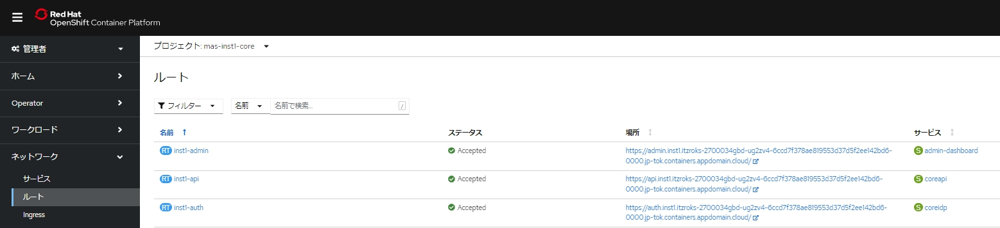

## 04.管理者ユーザーの作成

MAS install中に作成されたsuperuserを使って、manage管理者ユーザーであるmaxadminのパスワードを再設定します。

### 1. superuserのログインユーザー・パスワードの確認

1. OCP Webコンソールを開きます。
    
    ワークロード→シークレットへ移動します。

    

2. mas-inst1-coreプロジェクトを選択します。

    左上のプルダウンからプロジェクト名を「mas-inst1-core」に設定、superuserでフィルタリングします。  
    「inst1」の部分はMAS install時に「MAS Instance ID」で指定した値になります。

    

3. inst1-credentials-superuserを開きます。
   
   username / passwordの値をコピーしておきます。

   

### 2. 自己証明書設定

当手順では Administration Dashboard URLにブラウザからアクセスすると、自己署名証明書によるエラーが表示されます。  
各ブラウザの機能で自己署名証明書を許可する必要があります。

また、複数のドメイン(admin.~ ,api.~)に対して許可を行う必要があります。

1. Administration Dashboard URLの"admin"を"api"に変更してアクセスします。
    
    Administration Dashboard URLは、OCP Webコンソールのネットワーク→ルートへ移動し、  
    左上のプルダウンのプロジェクト名を「mas-inst1-core」に設定後、「inst1-admin」の場所(Location)にあります。  
    (この下の「3. MAS Core 管理コンソールへアクセス」の1/2の手順に説明があるので参考にしてください)

    例.「https://<strong>api</strong>.mas87infra.xxxx-1c23480da6d8f4e560816232d3da3f63-xxx.jp-tok.containers.appdomain.cloud/initialsetup」
      
    

2. 自己署名証明書によるエラーが表示されるため、各ブラウザの手順にて許可します。  
    (以下のようなjsonが応答します。当手順を実施しないでログインした場合、admin dashboardにコンテンツが表示されません)  

    

1. Administration Dashboard URLへアクセス。この際も、自己署名証明書によるエラーが表示されるため、各ブラウザの手順にて許可します。
    

2. superUserの「Username」「Password」を用いてログインします。
    

### 3. MAS Core 管理コンソールへアクセス

1. OCP Webコンソールを開きます。

    ネットワーク→ルートへ移動します。  
    左上のプルダウンからプロジェクト名を「mas-inst1-core」に設定されていることを確認します。
    

2. 「inst1-admin」の場所(Location)のURLをクリックします。

    

3. コピーしておいたUsername,Passwordを使ってログインします。

    

### 4. maxadmin ユーザーのパスワードの設定

1. MAS Adminコンソールにログインします。
    
    ログイン後、左のタブの「ユーザー」へ移動します。
    

    

2. maxadminを開いて、編集アイコンをクリックします。

    忘れたパスワードの置換をクリックします。
    

3. パスワードを設定します。

    

4. Eメールやライセンス情報を設定します。
   
   
   
   ライセンスはアプリケーション・ラインセンス、管理ライセンスともに適切に設定してください。
   

5. 変更の保存します。
6. 変更が同期されるまで待ちます。
   
   一度superuserをログアウトして、設定したパスワードを使用してmaxadminでログインすることができれば設定は完了です。  
  
7. (オプション)必要に応じてMANAGEのアプリケーションに入り、デモデータなどを確認します。 

    
    

### 前項
- [ 03_MAS/MANAGEインストール ](../03_manageinstall/index.md)

### 次項
- [ 05_導入後環境の確認 ](../05_confirm/index.md)
