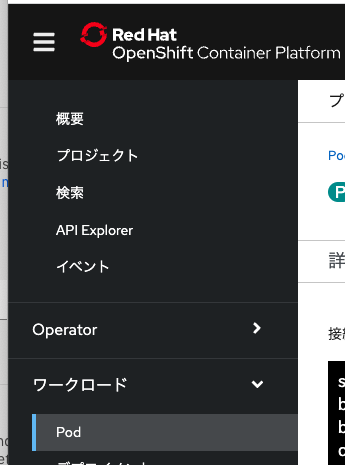
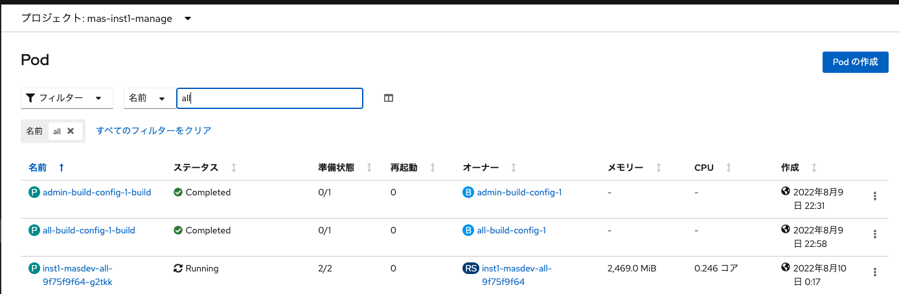
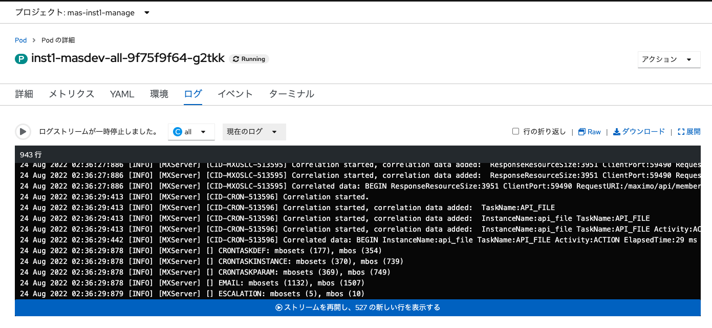
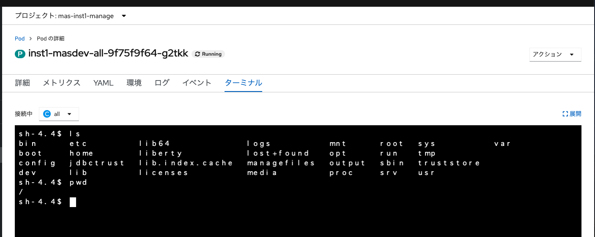
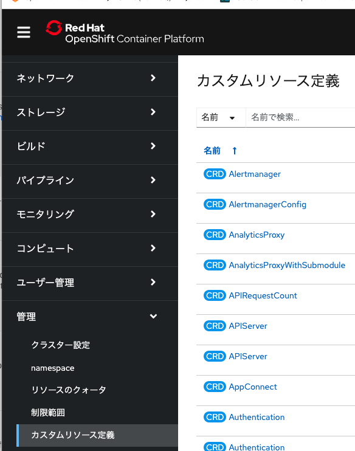
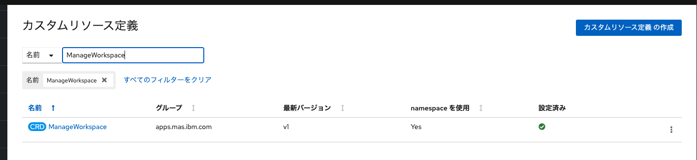
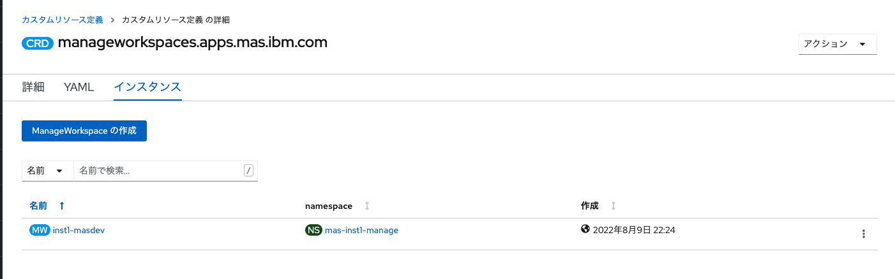
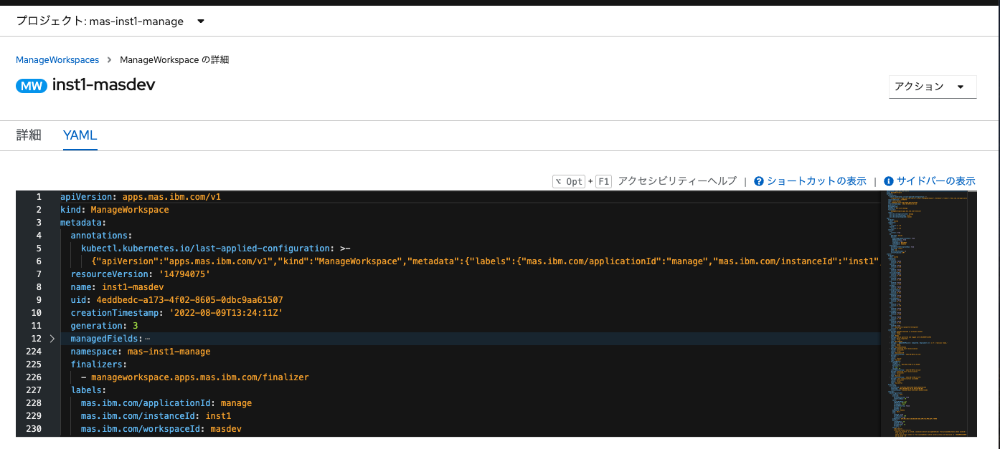

### 導入後環境の確認

## 1.Manageのインスタンスの確認

1. Openshift Webコンソール > Podを開きます。

2. プロジェクトで {mas-{インスタンス名}-manage}を指定し、allでフィルタする。{インスタンス名}-masdev-allのPodを開きます。

※当手順では、allタイプのサーバーバンドルで導入されています。

3. インスタンスの状態が確認できる。「ログ」タブからログが確認可能。「ターミナル」タブから当インスタンスへアクセスが可能です。

## 2.アクティベートの初期設定の確認

1. Openshift Webコンソール > 管理 > カスタムリソース定義を開きます。

2. 「ManageWorkspace」でフィルタし、見つかったカスタムリソース定義をクリックします。

3. 「インスタンス」タブを開き、「{インスタンス名}-masdev」を開きます。
   

4. 「yaml」タブを開きます。

当手順で導入された初期設定、アクティベート時の設定などが確認できます。
   
※構成変更については [11_参考.Manageの構成変更](../11_reactivate/index.md) を参照ください。

### 前項
- [ 04_管理者ユーザーの作成 ](../04_maxadmin/index.md)
